# Cyber LLM SOC Assistant

An AI assistant for security operations: it turns logs and natural-language questions into structured findings, threat-oriented predictions, and incident-response style guidance—with **step-by-step traces** so analysts can see how conclusions were reached.

---

## What you get (at a glance)

| Piece   | What it does                                                                                         |
| ------- | ---------------------------------------------------------------------------------------------------- |
| **G1**  | Single agent with tools (log parser, CTI, RAG), memory/sessions, adaptive model routing              |
| **G2**  | Multi-agent pipeline: log analysis → threat prediction → incident response → orchestrated summary    |
| **API** | FastAPI service under `services/api/` — analyze, chat, streaming workspace, sandbox, metrics, health |
| **Web** | Next.js app in `apps/web` — workspace UI with traces                                                 |
| **Lab** | Deliberately vulnerable OWASP-style app in `apps/vuln-lab` (local learning only)                     |

Frozen HTTP and tool contracts: [`docs/contracts.md`](docs/contracts.md), [`docs/tool-contracts.md`](docs/tool-contracts.md). ReAct trace shape and runtime integration: [`docs/trace-contract.md`](docs/trace-contract.md). Tool-layer operations: [`docs/tooling-runbook.md`](docs/tooling-runbook.md). Current architecture snapshot: [`docs/architecture-current-state.md`](docs/architecture-current-state.md).

---

## Current status (important)

- **G1:** implemented and production-ready for this project scope.
- **G2:** implemented and active (not a placeholder).
- **G2 runtime flow today:** `LogAnalyzer -> WorkerPlanner -> ThreatPredictor -> WorkerTask(s) -> IncidentResponder -> Verifier (with one retry) -> Orchestrator`.
- **Trace + safety gates:** active for both G1/G2 (`stop_reason`, budget controls, output policy, action gating).

---

## Architecture diagrams

**System architecture**



**G1+G2 flow**



---

## Prerequisites

- **Python 3.10–3.13** (see `requirements.txt` header; some deps exclude 3.14+ today)
- **Node.js 20+** (for the web app and lab)
- **Docker + Docker Compose** (recommended for the full three-service stack)
- **API keys** (see below): OpenAI, AlienVault OTX, Pinecone (RAG)

---

## Config and run the system

1. Copy the template and edit values:

   ```bash
   cp .env.example .env
   ```

2. **Required in `.env`**:

   - `OPENAI_API_KEY`
   - `OTX_API_KEY`
   - `PINECONE_API_KEY`

3. Runs **API (8000)**, **web (3000)**, and **lab (3100)** together.

   ```bash
   docker compose up --build -d
   ```

- Web: `http://localhost:3000`
- API docs: `http://localhost:8000/docs`
- Lab: `http://localhost:3100`

**Operator details** (volumes, lab ↔ API networking, URL overrides): [`docs/docker-setup.md`](docs/docker-setup.md).

---

## Everyday commands (Make)

| Command                                    | Purpose                                                                             |
| ------------------------------------------ | ----------------------------------------------------------------------------------- |
| `make lint`                                | Byte-compile critical Python packages (fast sanity check)                           |
| `make test`                                | Full pytest run for repository tests                                                |
| `make test-ci`                             | Curated core-workflow Python suite used by CI (`scripts/run_test_ci.py`)            |
| `make test-web`                            | Frontend unit tests (Vitest)                                                        |
| `make benchmark` / `make benchmark-report` | Offline benchmark pipeline (CI-safe defaults)                                       |
| `make smoke`                               | Quick compile + memory/session smoke tests                                          |
| `make smoke-checklist`                     | Scripted API checklist (health, core routes, sandbox, RAG mocks)                    |
| `make ci`                                  | Lint + CI tests + benchmark + smoke + web tests (heavy; mirrors most of CI locally) |
| `make validate-traces`                     | Trace validation helper (see `scripts/validate_traces.py`)                          |

**CI on GitHub** (Python 3.10 + 3.11): `.github/workflows/ci.yml` runs `make lint`, `make test-ci`, `make benchmark`, memory smoke, and web tests.

---

## How G1 works (short path)

1. Request hits FastAPI → CORS (`services/api/middleware.py`).
2. Input is validated; prompt-injection guard may return `stop_reason=needs_human`.
3. G1 loads the prompt version (`PROMPT_VERSION_G1`), session memory, and runs the agent loop with tools.
4. Structured report + **critic** + **action gating** + **output policy** run before the response is returned.
5. Response uses the standard envelope (`ApiResponse` in `services/api/schemas.py`).

**Endpoints:** `POST /api/v1/analyze/g1`, `POST /api/v1/chat` (`mode=g1`), `POST /api/v1/workspace/stream` (SSE), `POST /api/v1/sandbox/analyze`.

**`stop_reason` values:** `completed`, `needs_human`, `budget_exceeded`, `blocked`, `error` (see `docs/contracts.md` for the canonical list).

---

## How G2 works (current flow)

1. API sanitizes input and applies prompt-injection checks.
2. G2 runner executes staged nodes: log analysis, worker planning, threat prediction, dynamic worker tasks, incident response, verifier, orchestrator.
3. Runtime budgets enforce max steps/tool-calls/runtime and emit deterministic `stop_reason`.
4. Service-level review applies action gating + output policy guard before returning.
5. API returns structured `ApiResponse` + human-readable trace steps for UI.

**Endpoints:** `POST /api/v1/analyze/g2`, `POST /api/v1/chat` (`mode=g2`), `POST /api/v1/workspace/stream` (`mode=g2`).

---

## RAG (Pinecone + OpenAI)

RAG is **on** by default. The API does **not** ingest documents on startup. Retrieval uses a **Pinecone** index built from files under `data/knowledge/` (OpenAI embeddings).

1. Add `.md` / `.txt` (and other supported types) under `data/knowledge/`.
2. Set `PINECONE_API_KEY` and `PINECONE_INDEX_NAME` in `.env`.
3. Ingest (from repo root, with deps installed):

   ```bash
   python3 -c "from src.tools.rag_tools import ingest_knowledge_base; print(ingest_knowledge_base())"
   ```

4. Re-ingest after you change knowledge files or switch indexes.

Session **memory recall** uses the same `OPENAI_API_KEY` with `OPENAI_EMBEDDING_MODEL` (see `.env.example`).

---

## Sandbox and safety

- OWASP-style **sandbox** API routes (`/api/v1/sandbox/*`) are always on for local demos. The web app **`/sandbox`** page **watches vuln-lab logs** (browser → lab `system-logs`) and runs **G1** or **G2** on new `attack_detected` lines via `analyze/g1|g2`. The **vuln-lab** is the minimal storefront (login + search) for those attacks.
- Policy and gate reference: [`docs/policy-gates.md`](docs/policy-gates.md).
- Heavier verification (live API checks + real-LLM benchmark mode): [`docs/benchmark-evaluation.md`](docs/benchmark-evaluation.md) and [`CONTRIBUTING.md`](CONTRIBUTING.md).

---

## Benchmarks

- Datasets: `data/benchmarks/threat_cases.json`, `data/benchmarks/threat_cases_lab.json`
- Benchmark runs:

  ```bash
  make benchmark
  make benchmark-report
  ```

- Real LLM (local only; needs keys): `BENCHMARK_MODE=real-llm BENCHMARK_AGENT_MODE=g1 BENCHMARK_PROVIDER=openai make benchmark`

More methodology: [`docs/benchmark-evaluation.md`](docs/benchmark-evaluation.md).

---

## Repository layout

```text
src/
  agents/g1/          # single-agent runtime
  agents/g2/          # multi-agent workflow
  agents/shared/      # shared helpers (e.g. intent routing)
  config/             # Settings (env → `Settings`)
  sandbox/            # OWASP event simulation (API-facing)
  tools/              # log parser, CTI, RAG, envelopes
  utils/              # memory, sessions, evaluator, logging
services/api/         # FastAPI app (routes, services, guardrails)
apps/web/             # Next.js frontend
apps/vuln-lab/        # minimal 3-scenario vulnerable storefront (Express)
tests/                # unit tests + integration (some need real API keys locally)
scripts/              # benchmark, CI test runner, smoke checklist, trace validation
data/                 # knowledge, benchmarks, logs, sessions (runtime artifacts)
prompts/              # prompt templates referenced by Settings
```

---

## Contributing and policies

- [`CONTRIBUTING.md`](CONTRIBUTING.md)
- PR checklist: [`docs/pr-checklist.md`](docs/pr-checklist.md)
- Security: [`SECURITY.md`](SECURITY.md)
- Code of conduct: [`CODE_OF_CONDUCT.md`](CODE_OF_CONDUCT.md)
- License: [MIT](LICENSE)

---

## License

MIT
