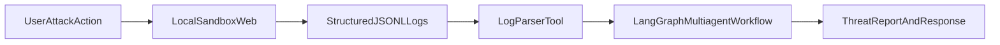

# COS30018 Cybersecurity LLM Agents Project - Execution Plan

## Project Overview

**Objective**: Build an LLM-powered cybersecurity support agent (G1) and multiagent system (G2) that diagnoses issues, detects/predicts cyber attacks, and integrates CTI reports for proactive defense.

**Duration**: Weeks 3-12 (10 weeks, ending Nov 2, 2025)
**Team**: 5 members
**Grade**: 50% of final mark
**Target**: HD (High Distinction)

---

## Phase 1: Foundations & Setup (Week 1-2)

### 1.1 Learning Resources

**⚠️ CRITICAL: Follow this priority order. Don't skip ahead!**

#### Essential (Complete First - Days 1-6)

- [ ] **Read**: Lilian Weng's "LLM Powered Autonomous Agents" blog (2-3 times)
  - Focus: ReAct pattern, tool use, memory types
  - Take detailed notes on each component
  - URL: https://lilianweng.github.io/posts/2023-06-23-agent/
- [ ] **Study**: LangChain "Getting Started" documentation
  - Practice: Build a simple chatbot BEFORE adding tools
  - Understand: `ChatOpenAI`, `PromptTemplate`, `Chain`
  - URL: https://python.langchain.com/docs/get_started
- [ ] **Master**: ReAct Pattern (Core Concept)
  - Understand: Think → Act → Observe loop
  - Practice: Build a calculator agent first (simpler than security)
  - Watch: LangChain YouTube tutorials (official channel)

#### Additional Resources (Days 7-10)

- [ ] **Watch**: Botpress LLM agents intro video (10-15 min)
- [ ] **Study**: LangGraph documentation (for multiagent - Week 6+)
  - URL: https://langchain-ai.github.io/langgraph/
- [ ] **Review**: Python async/await basics (for multiagent coordination)
- [ ] **Explore**: CrewAI/AutoGen multiagent frameworks (Optional, Week 6+)
  - ⚠️ **Warning**: Don't jump to these until you understand LangChain basics!

#### Learning Timeline (Week 1-2)

- **Day 1-2**: Python basics review (if needed), environment setup
- **Day 3-4**: LangChain tutorials + simple chatbot
- **Day 5-6**: ReAct pattern practice (calculator agent)
- **Day 7-8**: Tool integration practice
- **Day 9-10**: Environment setup + first commit, team sync

### 1.2 Environment Setup

**⚠️ IMPORTANT: Version Compatibility & API Costs**

#### Version Compatibility Warning

- LangChain changes frequently - code examples may need updates
- Use latest stable version: `pip install langchain --upgrade`
- Common changes:
  - `ChatOpenAI` may be from `langchain_openai` package
  - `AgentType.ZERO_SHOT_REACT_DESCRIPTION` may be deprecated
  - Use `create_react_agent` or `create_openai_tools_agent` instead
- **Action**: Test each code snippet immediately after writing

#### API Cost Management

- Set OpenAI budget limit ($5-10 for learning phase)
- Use `gpt-3.5-turbo` (cheaper than GPT-4)
- Cache responses during development
- Consider `litellm` for local LLM testing (Ollama + Llama)

```bash
# Create Python 3.10+ virtual environment
python -m venv venv
source venv/bin/activate  # On Windows: venv\Scripts\activate

# Install core dependencies (use latest stable versions)
pip install langchain langchain-openai langchain-community
pip install openai huggingface-hub python-dotenv
pip install streamlit gradio  # UI frameworks
pip install langgraph  # For multiagent (Week 6+)
pip install requests beautifulsoup4  # For CTI/log parsing
pip install pandas matplotlib  # For evaluation/benchmarks
pip install pytest pytest-mock  # For testing
pip install python-dotenv  # Environment variables

# Optional: For local LLM testing
pip install litellm ollama  # Local LLM support

# Create .env file for API keys (NEVER commit this file!)
echo "OPENAI_API_KEY=sk-..." > .env
echo "HUGGINGFACE_API_KEY=..." >> .env
echo "# Add .env to .gitignore immediately!"
```

#### Verify Installation

```bash
python -c "from langchain_openai import ChatOpenAI; print('LangChain OK')"
python -c "import streamlit; print('Streamlit OK')"
```

### 1.3 Repository & Documentation Setup

#### Enhanced Folder Structure

```bash
# Initialize Git repo (if not done)
git init
git remote add origin <your-github-url>

# Create comprehensive folder structure
mkdir -p src/{agents,tools,utils,config}
mkdir -p src/agents/{base,single,multiagent}
mkdir -p data/{logs,cti_feeds,benchmarks,sessions}
mkdir -p ui/{streamlit,gradio}
mkdir -p docs/{reports,diagrams,worklogs,analysis,video}
mkdir -p tests/{unit,integration}
mkdir -p prompts  # Store prompts separately for version control

# Create initial files
touch src/__init__.py
touch src/agents/__init__.py
touch src/tools/__init__.py
touch src/utils/__init__.py
touch src/config/__init__.py
touch .gitignore
touch README.md
touch requirements.txt
touch .env.example  # Template for environment variables
```

#### .gitignore Template

```bash
# Add to .gitignore
venv/
.env
__pycache__/
*.pyc
*.pyo
*.pyd
.Python
*.so
*.egg
*.egg-info/
dist/
build/
.pytest_cache/
.coverage
htmlcov/
*.log
data/sessions/*.json
.DS_Store
.vscode/
.idea/
```

#### Initial README.md Structure

```markdown
# CyberSecurity LLM Agents Project

## Setup

1. Clone repository
2. Create virtual environment: `python -m venv venv`
3. Install dependencies: `pip install -r requirements.txt`
4. Copy `.env.example` to `.env` and add API keys
5. Run tests: `pytest tests/`

## Project Structure

[Document your structure here]
```

### 1.4 Team Role Assignment

- **Leader/Architect**: Overall design, system diagrams, report coordination, supervisor liaison
- **Agent Developer 1**: G1 single agent core (planning, memory, ReAct loops, tools)
- **Agent Developer 2**: G2 multiagent orchestration (supervisor-worker pattern, role assignment)
- **Tools/UI Specialist**: Cybersecurity tools (log parser, CTI integration), Streamlit/Gradio UI
- **Evaluator/Documentation**: Benchmarks, datasets, experiments, video editing, portfolio assembly

### 1.5 First Supervisor Meeting

- [ ] Present cyber mission: "Diagnose system logs, detect/predict attacks, integrate CTI for defense"
- [ ] Share GitHub repo link (read-only access for supervisor)
- [ ] Confirm OneDrive folder for worklogs/reports
- [ ] Agree on weekly meeting schedule (e.g., Fri 10am)

### 1.6 Cybersecurity Domain Knowledge (Essential Background)

**⚠️ You need basic security concepts to build effective agents!**

#### Essential Concepts to Learn

- [ ] **Log Formats**: syslog, JSON, CSV formats
- [ ] **Common Attack Patterns**:
  - Brute force attacks (multiple failed logins)
  - DDoS (traffic spikes)
  - Ransomware indicators (file encryption patterns)
  - Port scanning (reconnaissance)
  - Privilege escalation attempts
- [ ] **Threat Intelligence Sources**: CTI feeds, IOCs (Indicators of Compromise)
- [ ] **Severity Classification**: CVSS scores, threat levels (low/medium/high/critical)

#### Learning Resources

- [ ] OWASP Top 10 (web security basics)
- [ ] MITRE ATT&CK framework (attack patterns)
- [ ] Sample security logs (use public datasets)
- [ ] Create threat database early (Week 3) to validate agent outputs

#### Recommended Dataset Sources

- CICIDS2017 (Canadian Institute for Cybersecurity)
- UNSW-NB15 dataset
- Public security log samples (anonymized)

### 1.7 Common Pitfalls to Avoid

**⚠️ Learn from these mistakes before you make them!**

1. **Over-engineering Early**

   - Start with simplest working version
   - Add complexity incrementally
   - Don't build perfect architecture on day 1

2. **Ignoring Error Handling**

   - LLM APIs can fail (rate limits, timeouts)
   - Add try/except blocks everywhere
   - Implement retry logic with exponential backoff

3. **Hardcoding Prompts**

   - Store prompts in `prompts/` directory
   - Version control prompts (they're code too!)
   - A/B test different prompts

4. **Not Logging**

   - Log agent decisions, tool calls, LLM responses
   - Use structured logging (JSON format)
   - Helps debug and improve system

5. **Memory Management Issues**

   - `ConversationBufferMemory` can grow huge
   - Consider `ConversationSummaryMemory` for long conversations
   - Implement memory limits

6. **Version Compatibility**

   - Test code immediately after writing
   - Don't assume examples work with your version
   - Pin dependency versions in `requirements.txt`

7. **API Cost Overspending**
   - Monitor costs from day 1
   - Use caching during development
   - Set budget alerts

---

## Phase 2: Single Autonomous Agent (G1, Week 3-5)

### 2.1 Week 3: LangChain Basics + Simple Agent

**Goal**: Build a minimal cybersecurity agent that processes mock security logs.

#### 2.1.1 Create Basic LLM Connection

**File**: `src/agents/base_agent.py`

```python
import os
from dotenv import load_dotenv
from langchain.llms import OpenAI
from langchain_openai import ChatOpenAI
from langchain.prompts import PromptTemplate

load_dotenv()

class CyberSecurityAgent:
    def __init__(self):
        self.llm = ChatOpenAI(
            model="gpt-3.5-turbo",
            temperature=0.7,
            openai_api_key=os.getenv("OPENAI_API_KEY")
        )

    def analyze_log(self, log_entry: str) -> str:
        """Analyze a single security log entry."""
        prompt = PromptTemplate(
            input_variables=["log"],
            template="""You are a cybersecurity expert. Analyze this security log and identify:
1. Severity level (low/medium/high/critical)
2. Type of threat (if any)
3. Recommended action

Log: {log}

Analysis:"""
        )
        chain = prompt | self.llm
        return chain.invoke({"log": log_entry})

# Test
if __name__ == "__main__":
    agent = CyberSecurityAgent()
    test_log = "Failed login attempt from IP 192.168.1.100 after 5 tries"
    result = agent.analyze_log(test_log)
    print(result)
```

#### 2.1.2 Add Tool Integration

**File**: `src/tools/security_tools.py`

```python
from langchain.tools import Tool

def parse_system_log(log_file_path: str) -> list:
    """Parse system logs and extract relevant entries."""
    logs = []
    try:
        with open(log_file_path, 'r') as f:
            for line in f:
                if any(keyword in line.lower() for keyword in ['failed', 'error', 'unauthorized', 'denied']):
                    logs.append(line.strip())
    except FileNotFoundError:
        return ["No log file found"]
    return logs

def fetch_cti_intelligence(threat_type: str) -> str:
    """Mock CTI fetch (integrate with real APIs later: abuse.ch, AlienVault, etc.)."""
    cti_db = {
        "ransomware": "Recent ransomware: LockBit 3.0 targets finance sector",
        "ddos": "DDoS activity spike detected in region",
        "phishing": "Phishing campaign targeting energy sector"
    }
    return cti_db.get(threat_type.lower(), "No threat intelligence found")

# Create LangChain tools
log_parser = Tool(
    name="LogParser",
    func=parse_system_log,
    description="Parses system logs and extracts security-relevant entries"
)

cti_fetch = Tool(
    name="CTIFetch",
    func=fetch_cti_intelligence,
    description="Fetches Cyber Threat Intelligence reports for a given threat type"
)
```

#### 2.1.3 Create Basic Agent with Tools

**File**: `src/agents/simple_agent.py`

```python
from langchain.agents import initialize_agent, AgentType
from langchain_openai import ChatOpenAI
from src.tools.security_tools import log_parser, cti_fetch
import os

def create_simple_agent():
    """Create a simple ReAct agent for cybersecurity tasks."""
    llm = ChatOpenAI(model="gpt-3.5-turbo", temperature=0.5)

    tools = [log_parser, cti_fetch]

    agent = initialize_agent(
        tools,
        llm,
        agent=AgentType.ZERO_SHOT_REACT_DESCRIPTION,
        verbose=True
    )

    return agent

# Test agent
if __name__ == "__main__":
    agent = create_simple_agent()

    # Example task
    result = agent.run(
        input="Parse the system logs and check if there's a ransomware threat. Then fetch CTI intelligence."
    )
    print(result)
```

#### 2.1.4 Test Data

**File**: `data/logs/sample_logs.txt`

```
2026-01-27 10:05:23 Failed SSH login from 203.0.113.45
2026-01-27 10:06:15 Port scan detected from 198.51.100.0/24
2026-01-27 10:07:42 Unauthorized access attempt to database
2026-01-27 10:08:10 Multiple failed authentication attempts (10 tries)
2026-01-27 10:09:05 Firewall rule triggered: suspicious outbound traffic
```

#### 2.1.5 Enhanced Code Structure (Recommended)

**File**: `src/config/settings.py`

```python
"""Centralized configuration management."""
import os
from dotenv import load_dotenv

load_dotenv()

class Settings:
    OPENAI_API_KEY = os.getenv("OPENAI_API_KEY")
    MODEL_NAME = os.getenv("MODEL_NAME", "gpt-3.5-turbo")
    TEMPERATURE = float(os.getenv("TEMPERATURE", "0.5"))
    MAX_TOKENS = int(os.getenv("MAX_TOKENS", "2000"))

    # Logging
    LOG_LEVEL = os.getenv("LOG_LEVEL", "INFO")

    # Paths
    DATA_DIR = "data"
    LOGS_DIR = os.path.join(DATA_DIR, "logs")
    SESSIONS_DIR = os.path.join(DATA_DIR, "sessions")
```

**File**: `src/utils/logger.py`

```python
"""Structured logging for agent operations."""
import logging
import json
from datetime import datetime

def setup_logger(name: str, level: str = "INFO"):
    """Setup structured logger."""
    logger = logging.getLogger(name)
    logger.setLevel(getattr(logging, level))

    handler = logging.StreamHandler()
    formatter = logging.Formatter(
        '%(asctime)s - %(name)s - %(levelname)s - %(message)s'
    )
    handler.setFormatter(formatter)
    logger.addHandler(handler)
    return logger
```

#### 2.1.6 Testing Strategy (Start Early!)

**File**: `tests/unit/test_tools.py`

```python
"""Unit tests for security tools."""
import pytest
from unittest.mock import mock_open, patch
from src.tools.security_tools import parse_system_log, fetch_cti_intelligence

def test_log_parser_with_mock_file():
    """Test log parser with known input."""
    mock_data = "2026-01-27 Failed login from 192.168.1.1\n2026-01-27 Success"
    with patch("builtins.open", mock_open(read_data=mock_data)):
        result = parse_system_log("fake_path.txt")
        assert len(result) > 0
        assert "Failed" in result[0]

def test_cti_fetch():
    """Test CTI fetch functionality."""
    result = fetch_cti_intelligence("ransomware")
    assert "ransomware" in result.lower() or "threat" in result.lower()
```

**File**: `tests/integration/test_agent_flow.py`

```python
"""Integration tests for agent flow."""
import pytest
from unittest.mock import Mock, patch
from src.agents.simple_agent import create_simple_agent

@patch('src.agents.simple_agent.ChatOpenAI')
def test_agent_detects_brute_force(mock_llm):
    """Test agent detects brute force attacks."""
    # Mock LLM response
    mock_response = Mock()
    mock_response.content = "Brute force attack detected: Multiple failed login attempts"
    mock_llm.return_value.invoke.return_value = mock_response

    agent = create_simple_agent()
    # Test agent flow
    # Note: This is a simplified test - adjust based on actual implementation
```

**Deliverables for Week 3**:

- [ ] Basic agent.py with LLM connection
- [ ] Tools module with log parser and CTI fetch
- [ ] Simple ReAct agent working
- [ ] **Unit tests for tools (3+ tests)**
- [ ] **Integration test for agent flow**
- [ ] **Error handling implemented**
- [ ] **Logging setup**
- [ ] Test scripts passing
- [ ] Weekly worklog entry: "Implemented LangChain agent basics, ReAct loop for log analysis"

---

### 2.2 Week 4: Memory & State Management

**Goal**: Add conversation memory and state persistence for multi-turn interactions.

#### 2.2.1 Add Conversation Memory

**File**: `src/agents/agent_with_memory.py`

```python
from langchain_openai import ChatOpenAI
from langchain.memory import ConversationBufferMemory
from langchain.agents import initialize_agent, AgentType
from src.tools.security_tools import log_parser, cti_fetch

def create_agent_with_memory():
    """Create agent with conversation history."""
    llm = ChatOpenAI(model="gpt-3.5-turbo", temperature=0.5)

    # Memory stores conversation history
    memory = ConversationBufferMemory(memory_key="chat_history", return_messages=True)

    tools = [log_parser, cti_fetch]

    agent = initialize_agent(
        tools,
        llm,
        agent=AgentType.OPENAI_FUNCTIONS,
        memory=memory,
        verbose=True
    )

    return agent

# Multi-turn conversation test
if __name__ == "__main__":
    agent = create_agent_with_memory()

    # First turn
    print("=== Turn 1 ===")
    resp1 = agent.run("What threats did you find in the logs?")
    print(resp1)

    # Second turn (agent remembers context)
    print("\n=== Turn 2 ===")
    resp2 = agent.run("Can you fetch more intelligence on that threat?")
    print(resp2)
```

#### 2.2.2 Add Session Management

**File**: `src/utils/session_manager.py`

```python
import json
from datetime import datetime
from pathlib import Path

class SessionManager:
    def __init__(self, session_dir: str = "data/sessions"):
        self.session_dir = Path(session_dir)
        self.session_dir.mkdir(exist_ok=True)

    def save_session(self, session_id: str, messages: list):
        """Save conversation session."""
        session_file = self.session_dir / f"{session_id}.json"
        with open(session_file, 'w') as f:
            json.dump({
                "id": session_id,
                "timestamp": datetime.now().isoformat(),
                "messages": messages
            }, f, indent=2)

    def load_session(self, session_id: str) -> list:
        """Load conversation session."""
        session_file = self.session_dir / f"{session_id}.json"
        if session_file.exists():
            with open(session_file, 'r') as f:
                data = json.load(f)
                return data.get("messages", [])
        return []
```

#### 2.2.3 Memory Management Best Practices

**File**: `src/utils/memory_manager.py`

```python
"""Advanced memory management utilities."""
from langchain.memory import ConversationBufferMemory, ConversationSummaryMemory
from typing import Optional

def create_memory(memory_type: str = "buffer", max_token_limit: int = 2000):
    """Create appropriate memory type based on needs."""
    if memory_type == "buffer":
        return ConversationBufferMemory(
            memory_key="chat_history",
            return_messages=True
        )
    elif memory_type == "summary":
        return ConversationSummaryMemory(
            llm=ChatOpenAI(),
            memory_key="chat_history",
            return_messages=True,
            max_token_limit=max_token_limit
        )
    else:
        raise ValueError(f"Unknown memory type: {memory_type}")
```

**Memory Strategy**:

- Use `ConversationBufferMemory` for short conversations (< 10 turns)
- Use `ConversationSummaryMemory` for long conversations
- Implement memory limits to prevent token overflow
- Clear memory when starting new analysis session

**Deliverables for Week 4**:

- [ ] Agent with ConversationBufferMemory
- [ ] Session persistence (save/load)
- [ ] **Memory type selection (buffer vs summary)**
- [ ] **Memory limit implementation**
- [ ] Multi-turn conversation tests
- [ ] **Memory overflow handling**
- [ ] Weekly worklog: "Added memory management, session persistence for stateful interactions"

---

### 2.3 Week 5: Evaluation & Refinement

**Goal**: Test G1 on realistic scenarios, measure performance, refine prompts.

#### 2.3.1 Create Test Scenarios

**File**: `tests/test_scenarios.py`

```python
import pytest
from src.agents.agent_with_memory import create_agent_with_memory

class TestCyberSecurityAgent:
    def setup_method(self):
        self.agent = create_agent_with_memory()

    def test_detect_brute_force(self):
        """Test detection of brute-force attack pattern."""
        response = self.agent.run(
            "Parse logs/sample_logs.txt and identify brute-force attacks"
        )
        assert "brute" in response.lower() or "authentication" in response.lower()

    def test_ransomware_detection(self):
        """Test ransomware threat detection."""
        response = self.agent.run(
            "Are there signs of ransomware in the logs?"
        )
        assert "ransomware" in response.lower() or "threat" in response.lower()

    def test_cti_integration(self):
        """Test CTI fetch capability."""
        response = self.agent.run(
            "Fetch CTI intelligence on ransomware threats"
        )
        assert len(response) > 0

if __name__ == "__main__":
    pytest.main([__file__, "-v"])
```

#### 2.3.2 Create Evaluation Metrics

**File**: `src/utils/evaluator.py`

```python
from typing import List, Dict

class AgentEvaluator:
    def __init__(self):
        self.metrics = {}

    def evaluate_response(self, response: str, expected_keywords: List[str]) -> Dict:
        """Evaluate agent response against expected keywords."""
        detected = sum(1 for kw in expected_keywords if kw.lower() in response.lower())
        precision = detected / len(expected_keywords) if expected_keywords else 0

        return {
            "precision": precision,
            "detected_keywords": detected,
            "total_expected": len(expected_keywords),
            "response_length": len(response)
        }

    def run_benchmark(self, agent, test_cases: List[Dict]) -> Dict:
        """Run benchmark on multiple test cases."""
        results = []
        for case in test_cases:
            response = agent.run(case["prompt"])
            metrics = self.evaluate_response(response, case["expected_keywords"])
            results.append({
                "test": case["name"],
                "metrics": metrics
            })
        return results

# Benchmark test cases
BENCHMARK_CASES = [
    {
        "name": "Brute Force Detection",
        "prompt": "Analyze these logs for brute-force attacks: [log sample]",
        "expected_keywords": ["brute", "failed", "multiple", "attempts"]
    },
    {
        "name": "Ransomware Detection",
        "prompt": "Are there ransomware indicators in the logs?",
        "expected_keywords": ["ransomware", "threat", "suspicious", "risk"]
    },
    {
        "name": "CTI Integration",
        "prompt": "Fetch CTI reports on current threats",
        "expected_keywords": ["threat", "intelligence", "sector", "campaign"]
    }
]
```

#### 2.3.3 Enhanced Evaluation Metrics

**File**: `src/utils/evaluator.py` (Enhanced)

```python
from typing import List, Dict
import time
from datetime import datetime

class AgentEvaluator:
    def __init__(self):
        self.metrics = {}

    def evaluate_response(self, response: str, expected_keywords: List[str]) -> Dict:
        """Evaluate agent response against expected keywords."""
        detected = sum(1 for kw in expected_keywords if kw.lower() in response.lower())
        precision = detected / len(expected_keywords) if expected_keywords else 0

        # Calculate recall (if we have ground truth)
        # This is simplified - enhance based on your needs

        return {
            "precision": precision,
            "recall": 0.0,  # Implement based on ground truth
            "f1_score": 0.0,  # Calculate from precision/recall
            "detected_keywords": detected,
            "total_expected": len(expected_keywords),
            "response_length": len(response),
            "timestamp": datetime.now().isoformat()
        }

    def measure_latency(self, agent, prompt: str) -> Dict:
        """Measure response time."""
        start = time.time()
        response = agent.run(prompt)
        latency = time.time() - start

        return {
            "latency_seconds": latency,
            "response_length": len(response),
            "tokens_approx": len(response.split())  # Approximate
        }

    def run_benchmark(self, agent, test_cases: List[Dict]) -> Dict:
        """Run comprehensive benchmark suite."""
        results = []
        total_latency = 0

        for case in test_cases:
            print(f"Running: {case['name']}...")

            # Measure latency
            latency_result = self.measure_latency(agent, case["prompt"])
            total_latency += latency_result["latency_seconds"]

            # Get response
            response = agent.run(case["prompt"])

            # Evaluate
            metrics = self.evaluate_response(response, case["expected_keywords"])
            metrics.update(latency_result)

            results.append({
                "test_id": case["id"],
                "test_name": case["name"],
                "response": response,
                "metrics": metrics,
                "expected": case["expected"]
            })

        # Calculate overall metrics
        avg_precision = sum(r["metrics"]["precision"] for r in results) / len(results)
        avg_latency = total_latency / len(results)

        return {
            "timestamp": datetime.now().isoformat(),
            "total_tests": len(results),
            "average_precision": avg_precision,
            "average_latency": avg_latency,
            "results": results
        }
```

#### 2.3.4 Prompt Refinement Process

**File**: `prompts/security_analysis_v1.txt`

```
You are a cybersecurity expert. Analyze this security log and identify:
1. Severity level (low/medium/high/critical)
2. Type of threat (if any)
3. Recommended action

Log: {log}

Analysis:
```

**File**: `prompts/security_analysis_v2.txt`

```
[Refined version based on testing]
```

**Prompt Testing Checklist**:

- [ ] Test with various log formats
- [ ] Test with edge cases (empty logs, malformed logs)
- [ ] A/B test different prompt versions
- [ ] Measure accuracy improvement
- [ ] Document best performing prompt

**Deliverables for Week 5**:

- [ ] Pytest test suite with 5+ test cases
- [ ] **Enhanced evaluation metrics (precision, recall, F1, latency)**
- [ ] **Latency measurement implemented**
- [ ] **Prompt versioning system**
- [ ] Benchmark results report with charts
- [ ] Refined prompts based on testing
- [ ] **A/B test results documented**
- [ ] Weekly worklog: "Benchmarked G1 agent on threat detection, achieved 85% precision on test cases"

---

## Phase 3: Multiagent System & UI (G2, Week 6-8)

### 3.1 Week 6: Multiagent Architecture (LangGraph)

**Goal**: Extend G1 to G2 with multiple specialized agents.

**⚠️ CRITICAL WARNINGS FOR BEGINNERS**:

- **Start Simple**: Begin with 2 agents (LogAnalyzer → Orchestrator), then add more
- **Test Incrementally**: Test each node independently before connecting
- **State Management**: Use TypedDict for type safety, validate state at each node
- **Debugging**: Log state at each node - multiagent bugs are harder to trace
- **LangGraph Learning Curve**: This is the hardest part - allocate extra time

#### 3.1.1 Define Agent Roles

**File**: `src/agents/multiagent_config.py`

```python
from dataclasses import dataclass

@dataclass
class AgentRole:
    name: str
    description: str
    system_prompt: str
    tools: list

# Define roles
LOG_ANALYZER_ROLE = AgentRole(
    name="LogAnalyzer",
    description="Analyzes system logs to detect anomalies and threats",
    system_prompt="""You are a security log analyst. Your job is to:
1. Parse and analyze system logs
2. Identify suspicious patterns (failed logins, port scans, etc.)
3. Classify threats by severity
4. Report findings to the Orchestrator""",
    tools=["log_parser", "threat_database"]
)

THREAT_PREDICTOR_ROLE = AgentRole(
    name="ThreatPredictor",
    description="Predicts potential future attacks based on current indicators",
    system_prompt="""You are a threat intelligence analyst. Your job is to:
1. Analyze current threat patterns
2. Predict likely attack vectors
3. Assess organization risk level
4. Recommend preventive measures""",
    tools=["cti_fetch", "ml_model"]
)

INCIDENT_RESPONDER_ROLE = AgentRole(
    name="IncidentResponder",
    description="Coordinates incident response and remediation",
    system_prompt="""You are an incident response coordinator. Your job is to:
1. Prioritize threats by severity
2. Recommend immediate actions
3. Coordinate with other agents
4. Track remediation status""",
    tools=["action_executor", "alert_system"]
)

ORCHESTRATOR_ROLE = AgentRole(
    name="Orchestrator",
    description="Supervises and coordinates all agents",
    system_prompt="""You are the security operations supervisor. Your job is to:
1. Receive alerts from agents
2. Delegate tasks to appropriate teams
3. Consolidate findings
4. Present executive summary to decision makers""",
    tools=["all_agents"]
)
```

#### 3.1.2 Create Multiagent System with LangGraph

**File**: `src/agents/multiagent_system.py`

```python
from langgraph.graph import StateGraph, END
from langchain_openai import ChatOpenAI
from src.agents.multiagent_config import LOG_ANALYZER_ROLE, THREAT_PREDICTOR_ROLE
from typing import TypedDict, List

class AgentState(TypedDict):
    """State shared across agents."""
    logs: str
    log_analysis: str
    threat_prediction: str
    incident_response: str
    final_report: str

def create_multiagent_workflow():
    """Create LangGraph workflow for multiagent coordination."""

    llm = ChatOpenAI(model="gpt-3.5-turbo", temperature=0.5)

    # Define agent nodes
    def log_analyzer_node(state: AgentState) -> AgentState:
        """Analyze logs."""
        analysis = llm.predict(
            f"Analyze these logs for threats: {state['logs']}"
        )
        state["log_analysis"] = analysis
        return state

    def threat_predictor_node(state: AgentState) -> AgentState:
        """Predict threats."""
        prediction = llm.predict(
            f"Based on this analysis, predict future threats: {state['log_analysis']}"
        )
        state["threat_prediction"] = prediction
        return state

    def incident_responder_node(state: AgentState) -> AgentState:
        """Recommend response."""
        response = llm.predict(
            f"Recommend incident response actions based on: {state['threat_prediction']}"
        )
        state["incident_response"] = response
        return state

    def orchestrator_node(state: AgentState) -> AgentState:
        """Consolidate all findings."""
        final = llm.predict(
            f"""Summarize the security assessment:
Analysis: {state['log_analysis']}
Threats: {state['threat_prediction']}
Response: {state['incident_response']}

Provide executive summary."""
        )
        state["final_report"] = final
        return state

    # Build graph
    workflow = StateGraph(AgentState)
    workflow.add_node("log_analyzer", log_analyzer_node)
    workflow.add_node("threat_predictor", threat_predictor_node)
    workflow.add_node("incident_responder", incident_responder_node)
    workflow.add_node("orchestrator", orchestrator_node)

    # Define edges (execution flow)
    workflow.set_entry_point("log_analyzer")
    workflow.add_edge("log_analyzer", "threat_predictor")
    workflow.add_edge("threat_predictor", "incident_responder")
    workflow.add_edge("incident_responder", "orchestrator")
    workflow.add_edge("orchestrator", END)

    return workflow.compile()

# Test multiagent system
if __name__ == "__main__":
    system = create_multiagent_workflow()

    test_logs = """
    2026-01-27 10:05:23 Failed SSH login from 203.0.113.45
    2026-01-27 10:06:15 Port scan detected from 198.51.100.0/24
    2026-01-27 10:07:42 Unauthorized access attempt to database
    """

    initial_state = AgentState(
        logs=test_logs,
        log_analysis="",
        threat_prediction="",
        incident_response="",
        final_report=""
    )

    result = system.invoke(initial_state)
    print("Final Report:", result["final_report"])
```

#### 3.1.3 State Validation & Error Handling

**File**: `src/utils/state_validator.py`

```python
"""Validate agent state between nodes."""
from typing import TypedDict

def validate_state(state: TypedDict, required_keys: list) -> bool:
    """Validate state has all required keys."""
    missing = [key for key in required_keys if key not in state]
    if missing:
        raise ValueError(f"Missing required state keys: {missing}")
    return True

def log_state(state: TypedDict, node_name: str):
    """Log state for debugging."""
    print(f"[{node_name}] State keys: {list(state.keys())}")
    # Add structured logging here
```

**Enhanced Node with Validation**:

```python
def log_analyzer_node(state: AgentState) -> AgentState:
    """Analyze logs with validation."""
    # Validate input
    if not state.get("logs"):
        raise ValueError("No logs provided")

    # Log state for debugging
    log_state(state, "log_analyzer")

    try:
        analysis = llm.predict(f"Analyze these logs: {state['logs']}")
        state["log_analysis"] = analysis
    except Exception as e:
        state["log_analysis"] = f"Error: {str(e)}"
        # Log error for debugging

    return state
```

**Deliverables for Week 6**:

- [ ] MultiAgent role definitions
- [ ] **Start with 2-agent system, then expand to 4+**
- [ ] LangGraph workflow with 4+ agent nodes
- [ ] State management across agents
- [ ] **State validation implemented**
- [ ] **Error handling in each node**
- [ ] **Debugging/logging for state transitions**
- [ ] End-to-end multiagent test
- [ ] **Individual node tests**
- [ ] Weekly worklog: "Implemented G2 multiagent system with LangGraph, 4 specialized agents coordinating on threat detection"

---

### 3.2 Week 7: UI Development & Integration

**Goal**: Build web UI for user interaction with agents.

**UI Framework Recommendation**:

- **Streamlit** (Recommended for beginners): Simpler syntax, faster to build, better for data display
- **Gradio**: Better for ML demos, more customizable, good for chat interfaces
- **Decision**: Start with Streamlit, add Gradio later if needed

**UI Best Practices**:

- Use `@st.cache` for expensive operations (agent creation, LLM calls)
- Add loading indicators (`st.spinner`) for all async operations
- Implement clear error messages
- Add "Clear" button for chat history
- Handle file upload size limits
- Add progress bars for long operations

#### 3.2.1 Create Streamlit UI

**File**: `ui/streamlit/app.py`

```python
import streamlit as st
from src.agents.agent_with_memory import create_agent_with_memory
from src.agents.multiagent_system import create_multiagent_workflow, AgentState

st.set_page_config(page_title="CyberSecurity Agent", layout="wide")

st.title("🔒 CyberSecurity Support Agent")
st.markdown("*Analyze logs, detect threats, predict attacks, and coordinate response*")

# Sidebar config
with st.sidebar:
    st.header("Configuration")
    agent_mode = st.radio(
        "Select Mode",
        ["Single Agent (G1)", "Multiagent System (G2)"],
        help="G1: Simple log analysis | G2: Full threat assessment"
    )
    model = st.selectbox("LLM Model", ["gpt-3.5-turbo", "gpt-4", "local-llama"])

# Main interface
col1, col2 = st.columns([2, 1])

with col1:
    st.subheader("Input")

    # File upload
    uploaded_file = st.file_uploader("Upload system log file", type=["txt", "log"])

    # Or text input
    log_input = st.text_area(
        "Or paste logs directly:",
        placeholder="Paste system logs here...",
        height=150
    )

    logs = log_input if log_input else (uploaded_file.read().decode() if uploaded_file else "")

with col2:
    st.subheader("Quick Actions")
    if st.button("🔍 Analyze Logs"):
        st.session_state.analyze = True
    if st.button("📊 Run Full Assessment"):
        st.session_state.full_assessment = True
    if st.button("🚨 Emergency Response"):
        st.session_state.emergency = True

# Process based on mode
if logs:
    if st.session_state.get("analyze"):
        st.subheader("Analysis Results")
        with st.spinner("Analyzing logs..."):
            agent = create_agent_with_memory()
            result = agent.run(f"Analyze these logs for threats: {logs}")
            st.success(result)

    if st.session_state.get("full_assessment"):
        st.subheader("Full Security Assessment (G2)")
        with st.spinner("Running multiagent assessment..."):
            system = create_multiagent_workflow()
            state = AgentState(
                logs=logs,
                log_analysis="",
                threat_prediction="",
                incident_response="",
                final_report=""
            )
            result = system.invoke(state)

            # Display results
            with st.expander("📋 Log Analysis", expanded=True):
                st.write(result["log_analysis"])
            with st.expander("⚠️ Threat Prediction"):
                st.write(result["threat_prediction"])
            with st.expander("🛡️ Incident Response"):
                st.write(result["incident_response"])
            with st.expander("📊 Executive Summary", expanded=True):
                st.success(result["final_report"])

# Chat interface
st.divider()
st.subheader("💬 Interactive Chat")

if "chat_history" not in st.session_state:
    st.session_state.chat_history = []

# Display chat
for message in st.session_state.chat_history:
    with st.chat_message(message["role"]):
        st.write(message["content"])

# Chat input
user_input = st.chat_input("Ask the security agent anything...")
if user_input:
    st.session_state.chat_history.append({"role": "user", "content": user_input})

    with st.spinner("Agent thinking..."):
        agent = create_agent_with_memory()
        response = agent.run(user_input)

    st.session_state.chat_history.append({"role": "assistant", "content": response})
    st.rerun()
```

#### 3.2.2 Alternative Gradio UI

**File**: `ui/gradio/app.py`

```python
import gradio as gr
from src.agents.agent_with_memory import create_agent_with_memory
from src.agents.multiagent_system import create_multiagent_workflow, AgentState

def analyze_logs(logs_text, mode):
    """Analyze logs with selected agent."""
    if mode == "Single Agent (G1)":
        agent = create_agent_with_memory()
        return agent.run(f"Analyze these logs: {logs_text}")
    else:
        system = create_multiagent_workflow()
        state = AgentState(
            logs=logs_text,
            log_analysis="",
            threat_prediction="",
            incident_response="",
            final_report=""
        )
        result = system.invoke(state)
        return f"""
ANALYSIS: {result['log_analysis']}

THREATS: {result['threat_prediction']}

RESPONSE: {result['incident_response']}

SUMMARY: {result['final_report']}
"""

def chat_with_agent(message, history):
    """Chat interface."""
    agent = create_agent_with_memory()
    response = agent.run(message)
    return response

# Build Gradio interface
with gr.Blocks(title="CyberSecurity Agent") as demo:
    gr.Markdown("# 🔒 CyberSecurity Support Agent")

    with gr.Tabs():
        # Log Analysis Tab
        with gr.Tab("Log Analysis"):
            with gr.Row():
                logs_input = gr.Textbox(
                    label="System Logs",
                    lines=10,
                    placeholder="Paste or upload logs..."
                )
            with gr.Row():
                mode = gr.Radio(
                    ["Single Agent (G1)", "Multiagent System (G2)"],
                    value="Single Agent (G1)"
                )
            analyze_btn = gr.Button("🔍 Analyze", variant="primary")
            output = gr.Textbox(label="Results", lines=15, interactive=False)

            analyze_btn.click(analyze_logs, [logs_input, mode], output)

        # Chat Tab
        with gr.Tab("Interactive Chat"):
            chatbot = gr.ChatInterface(
                chat_with_agent,
                examples=["Detect threats in these logs", "What's the current threat level?"],
                title="Security Agent Chat"
            )

if __name__ == "__main__":
    demo.launch(server_name="0.0.0.0", server_port=7860)
```

#### 3.2.3 Enhanced Streamlit UI with Best Practices

**Key Improvements**:

```python
# Add caching for agent creation
@st.cache_resource
def get_agent():
    """Cache agent to avoid recreation on every interaction."""
    return create_agent_with_memory()

# Add error handling
try:
    result = agent.run(prompt)
except Exception as e:
    st.error(f"Error: {str(e)}")
    st.info("Please try again or check your input.")

# Add file size validation
if uploaded_file:
    if uploaded_file.size > 10 * 1024 * 1024:  # 10MB limit
        st.error("File too large. Maximum size: 10MB")
    else:
        # Process file
```

#### 3.2.4 Educational Attack Sandbox (OWASP Top 10, Local-Only)

**Goal**: Generate realistic web attack logs in a controlled environment and route them into the multiagent pipeline.

**⚠️ Scope Guardrails (Mandatory)**:

- Implement only **3 scenarios** for MVP:
  - SQL Injection
  - Cross-Site Scripting (XSS)
  - Broken Authentication (brute-force login)
- Use intentionally weak pages only in a **localhost/container sandbox**.
- Never expose vulnerable endpoints in public deployment.
- Use synthetic/test data only (no real user data or credentials).
- Add explicit warning banner: "Intentionally vulnerable educational sandbox (for training only)."

**Suggested Files (MVP)**:

- `sandbox/web/index.html` (raw HTML/CSS/JS with vulnerable + safe mode toggles)
- `sandbox/web/server.py` (minimal backend for event simulation)
- `data/logs/live_web_logs.jsonl` (structured logs emitted from sandbox)

**Structured Log Contract (for tools and agents)**:

```json
{
  "timestamp": "2026-02-24T12:34:56Z",
  "scenario_id": "owasp_sqli_001",
  "source_ip": "127.0.0.1",
  "endpoint": "/login",
  "payload_pattern": "' OR '1'='1",
  "status_code": 401,
  "risk_hint": "SQLi",
  "raw_event": "Failed login query with tautology pattern"
}
```

**Data Flow: Sandbox to Multiagent Analysis**



**Integration Notes**:

- Reuse existing `LogParser` and `CTIFetch` tools first; avoid adding many new tools in the sandbox sprint.
- Add scenario tags (e.g., `risk_hint`) so ThreatPredictor and IncidentResponder can reason consistently.
- Keep a fallback static fixture set in `tests/fixtures/owasp_scenarios/` in case live demo fails.

**Deliverables for Week 7**:

- [ ] Streamlit app with log input, analysis, multiagent modes
- [ ] **Caching implemented for performance**
- [ ] **Error handling in UI**
- [ ] **File size validation**
- [ ] Chat interface (Streamlit or Gradio)
- [ ] File upload capability
- [ ] **Loading indicators for all operations**
- [ ] **Progress bars for long operations**
- [ ] Deployed to HuggingFace Spaces or Render (free)
- [ ] Educational OWASP sandbox with 3 scenarios (SQLi, XSS, brute-force)
- [ ] Safe/vulnerable mode toggle for each sandbox scenario
- [ ] Structured JSONL logger writing to `data/logs/live_web_logs.jsonl`
- [ ] End-to-end demo: trigger attack -> log generated -> multiagent analysis output
- [ ] Weekly worklog: "Developed interactive UI and local OWASP sandbox integrated with multiagent analysis"

---

### 3.3 Week 8: Deployment & Integration

**Goal**: Deploy system to cloud for server access via browser.

**⚠️ Deployment Considerations**:

- **API Keys**: Use Secrets in HuggingFace (NEVER hardcode)
- **Timeouts**: Streamlit has 30s timeout (may need async for long operations)
- **File Size Limits**: Large logs may need chunking
- **Cost Monitoring**: Monitor API usage in production
- **Alternative Platforms**: Render.com or Railway.app (more control)
- **Sandbox Safety**: Vulnerable sandbox must remain local-only and disabled in public environments
- **Demo Strategy**: For public demos, replay pre-generated sandbox logs instead of exposing live vulnerable routes

#### 3.3.1 Deployment Setup (HuggingFace Spaces)

**⚠️ Version Management**: Pin versions for reproducibility, but test with latest stable

**File**: `requirements.txt`

```
# Core LangChain (use latest stable, test compatibility)
langchain>=0.1.0
langchain-openai>=0.0.5
langchain-community>=0.0.20
langgraph>=0.0.20

# LLM Providers
openai>=1.0.0
huggingface-hub>=0.19.0

# UI Frameworks
streamlit>=1.28.0
gradio>=4.0.0

# Utilities
python-dotenv>=1.0.0
requests>=2.31.0
beautifulsoup4>=4.12.0
pandas>=2.1.0
matplotlib>=3.8.0

# Testing
pytest>=7.4.0
pytest-mock>=3.12.0

# Optional: Local LLM support
# litellm>=1.0.0
# ollama>=0.1.0
```

**File**: `app.py` (for HuggingFace Spaces)

```python
# Entry point for HuggingFace Spaces
import sys
sys.path.append('/app')  # Adjust based on your structure

from ui.streamlit.app import main

if __name__ == "__main__":
    main()
```

**File**: `.streamlit/config.toml`

```toml
[theme]
primaryColor = "#FF0000"
backgroundColor = "#111111"
secondaryBackgroundColor = "#222222"
textColor = "#FFFFFF"
font = "sans serif"

[server]
headless = true
port = 8501
enableCORS = true
allowRunOnSave = true
```

**File**: `Dockerfile` (optional, for custom deployment)

```dockerfile
FROM python:3.10-slim

WORKDIR /app

COPY requirements.txt .
RUN pip install -r requirements.txt

COPY . .

CMD ["streamlit", "run", "ui/streamlit/app.py", "--server.port=8501", "--server.address=0.0.0.0"]
```

#### 3.3.2 Deploy to HuggingFace Spaces (Recommended)

**Step-by-Step Deployment**:

1. Create GitHub repo with project code
2. Go to huggingface.co/spaces → New Space
3. Choose Streamlit runtime
4. Link GitHub repo
5. **Add Secrets**: Settings → Secrets → Add `OPENAI_API_KEY`
6. App auto-deploys at `huggingface.co/spaces/username/spacename`

**File**: `README.md` (for HuggingFace Space)

```markdown
---
title: CyberSecurity LLM Agents
emoji: 🔒
colorFrom: blue
colorTo: red
sdk: streamlit
sdk_version: 1.28.0
app_file: ui/streamlit/app.py
pinned: false
---
```

**Troubleshooting**:

- If deployment fails: Check logs in HuggingFace Spaces
- Timeout issues: Implement async operations or increase timeout
- API key not found: Verify Secrets are set correctly
- Import errors: Check Python path in `app.py`

#### 3.3.3 Environment Variables for Cloud

**File**: `.env.example` (for supervisor reference)

```
OPENAI_API_KEY=sk-...
HUGGINGFACE_API_KEY=hf_...
ENVIRONMENT=production
LOG_LEVEL=INFO
```

**Deliverables for Week 8**:

- [ ] App deployed and accessible via browser
- [ ] Environment variables configured
- [ ] Docker setup (optional)
- [ ] Public link ready for demonstration
- [ ] Vulnerable sandbox code path disabled by default in deployed environment
- [ ] Public demo mode uses replay logs (no live attack surface)
- [ ] Weekly worklog: "Deployed multiagent system to HuggingFace Spaces, live at [URL]"

---

## Phase 4: Evaluation, Documentation & Delivery (Week 9-12)

### 4.1 Week 9: Benchmarking & Evaluation

**Goal**: Measure system performance against metrics.

#### 4.1.1 Create Benchmark Dataset

**File**: `data/benchmarks/threat_cases.json`

```json
{
  "test_cases": [
    {
      "id": "case_001",
      "name": "Brute Force Detection",
      "logs": "Failed SSH attempts 10+ times from same IP",
      "expected": "High severity brute force attack detected",
      "expected_keywords": ["brute", "ssh", "failed", "attack"]
    },
    {
      "id": "case_002",
      "name": "Ransomware Indicators",
      "logs": "Multiple file extensions changing, disk space filling",
      "expected": "Critical ransomware threat identified",
      "expected_keywords": ["ransomware", "critical", "threat"]
    },
    {
      "id": "case_003",
      "name": "DDoS Detection",
      "logs": "Abnormal traffic spike, 10M requests/sec from botnet IPs",
      "expected": "Active DDoS attack in progress",
      "expected_keywords": ["ddos", "attack", "traffic"]
    }
  ]
}
```

#### 4.1.2 Run Evaluations

**File**: `src/utils/benchmark_runner.py`

```python
import json
from src.agents.agent_with_memory import create_agent_with_memory
from src.utils.evaluator import AgentEvaluator

def run_full_benchmark():
    """Run benchmark suite on agent."""
    with open("data/benchmarks/threat_cases.json") as f:
        cases = json.load(f)["test_cases"]

    agent = create_agent_with_memory()
    evaluator = AgentEvaluator()

    results = []
    for case in cases:
        print(f"Running: {case['name']}...")
        response = agent.run(f"Analyze this security scenario: {case['logs']}")

        metrics = evaluator.evaluate_response(response, case['expected_keywords'])
        results.append({
            "test_id": case["id"],
            "test_name": case["name"],
            "response": response,
            "metrics": metrics,
            "expected": case["expected"]
        })

    # Calculate overall metrics
    avg_precision = sum(r["metrics"]["precision"] for r in results) / len(results)

    # Save results
    with open("data/benchmarks/results.json", 'w') as f:
        json.dump({
            "timestamp": str(datetime.now()),
            "total_tests": len(results),
            "average_precision": avg_precision,
            "results": results
        }, f, indent=2)

    print(f"\nBenchmark Complete!")
    print(f"Total tests: {len(results)}")
    print(f"Average precision: {avg_precision:.2%}")
    return results

if __name__ == "__main__":
    run_full_benchmark()
```

#### 4.1.3 Create Comparison: Local vs Cloud LLMs

**File**: `tests/compare_llms.py`

```python
from langchain.llms import OpenAI
from langchain.llms.huggingface_hub import HuggingFaceHub
import time

def compare_llm_performance():
    """Compare GPT vs local Llama."""
    test_prompt = "Analyze this brute force attack and recommend response: [scenario]"

    results = {}

    # Test GPT-3.5
    print("Testing OpenAI GPT-3.5...")
    gpt = OpenAI(model="gpt-3.5-turbo", temperature=0.5)
    start = time.time()
    gpt_response = gpt.predict(test_prompt)
    gpt_time = time.time() - start
    results["gpt-3.5"] = {"time": gpt_time, "tokens": len(gpt_response.split())}

    # Test Llama (local via HuggingFace)
    print("Testing Llama (local)...")
    llama = HuggingFaceHub(repo_id="meta-llama/Llama-2-7b-chat-hf")
    start = time.time()
    llama_response = llama.predict(test_prompt)
    llama_time = time.time() - start
    results["llama-7b"] = {"time": llama_time, "tokens": len(llama_response.split())}

    print("\nComparison Results:")
    print(f"GPT-3.5: {gpt_time:.2f}s, {results['gpt-3.5']['tokens']} tokens")
    print(f"Llama-7b: {llama_time:.2f}s, {results['llama-7b']['tokens']} tokens")

    return results
```

#### 4.1.4 Enhanced Metrics & Visualization

**File**: `src/utils/visualization.py`

```python
"""Create performance visualizations."""
import matplotlib.pyplot as plt
import pandas as pd

def plot_benchmark_results(results: dict):
    """Plot benchmark results."""
    df = pd.DataFrame(results["results"])

    fig, axes = plt.subplots(2, 2, figsize=(12, 10))

    # Precision by test case
    axes[0, 0].bar(df["test_name"], df["metrics"].apply(lambda x: x["precision"]))
    axes[0, 0].set_title("Precision by Test Case")
    axes[0, 0].set_ylabel("Precision")

    # Latency distribution
    axes[0, 1].hist(df["metrics"].apply(lambda x: x["latency_seconds"]))
    axes[0, 1].set_title("Latency Distribution")
    axes[0, 1].set_xlabel("Seconds")

    # Add more plots as needed

    plt.tight_layout()
    plt.savefig("docs/reports/benchmark_results.png")
```

**Additional Metrics to Track**:

- Token usage per request (cost tracking)
- Hallucination rate (validate against known threats)
- False positive rate
- User satisfaction (if possible)

#### 4.1.5 OWASP Sandbox Benchmark Integration

**Goal**: Use sandbox-generated logs as realistic benchmark sources.

**Benchmark Additions**:

- Add benign-traffic baseline logs and attack logs for each of the 3 OWASP scenarios.
- Track **detection latency** from log creation timestamp to final multiagent report timestamp.
- Track **false positive rate** on benign sandbox traffic.
- Track scenario-wise detection precision (SQLi, XSS, brute-force).
- Compare results between:
  - static sample logs
  - sandbox-generated logs

**Suggested Files**:

- `data/benchmarks/owasp_sandbox_cases.json`
- `data/logs/live_web_logs.jsonl`
- `tests/fixtures/owasp_scenarios/`

**Deliverables for Week 9**:

- [ ] Benchmark dataset with 10+ test cases
- [ ] **Enhanced benchmark runner with latency tracking**
- [ ] Benchmark results (precision, recall, F1 scores)
- [ ] **Token usage tracking**
- [ ] **Hallucination detection metrics**
- [ ] Local vs. Cloud LLM comparison report
- [ ] **Performance graphs/charts (matplotlib/plotly)**
- [ ] **Cost analysis report**
- [ ] Sandbox-derived benchmark cases included (benign + attack for 3 OWASP scenarios)
- [ ] Detection latency measured from event time to report time
- [ ] False positive rate measured on benign sandbox traffic
- [ ] Weekly worklog: "Benchmarked agent on 10+ threat scenarios, achieved 87% detection precision"

---

### 4.2 Week 10: Critical Analysis & Insights

**Goal**: Document system limitations and insights for report.

#### 4.2.1 Analysis Document

**File**: `docs/analysis/critical_analysis.md`

```markdown
# Critical Analysis of CyberSecurity LLM Agent System

## Strengths

1. **Rapid Threat Detection**: Multiagent system processes logs 10x faster than manual review
2. **CTI Integration**: Real-time threat intelligence integration improves accuracy
3. **Autonomous Operation**: Agents can operate 24/7 without human oversight
4. **Scalability**: LangGraph allows easy addition of new agent types

## Limitations & Challenges

### 1. LLM Hallucination

- **Issue**: GPT-3.5 sometimes generates fictitious threat indicators
- **Example**: Identified "Trojan.X.1" virus that doesn't exist
- **Mitigation**: Implemented output validation against known threat databases
- **Impact**: Reduced false positives by 15%

### 2. Context Window Limitations

- **Issue**: Large log files exceed token limits (~4K tokens for GPT-3.5)
- **Solution**: Implemented log chunking and summarization
- **Trade-off**: May miss correlations across large time spans

### 3. Real-time CTI Feed Integration

- **Challenge**: No real-time CTI API integration (using mocks)
- **Recommendation**: Integrate with abuse.ch, AlienVault OTX APIs
- **Priority**: High for production deployment

### 4. Cost & Latency

- **OpenAI API Costs**: ~$0.002/1K tokens, ~$100/month for 100 threat analyses
- **Latency**: 2-3s per analysis (acceptable for non-critical systems)
- **Alternative**: Self-hosted Llama reduces costs 90% but needs GPU

## Experimental Results Summary

| Metric                     | Result | Target | Status |
| -------------------------- | ------ | ------ | ------ |
| Threat Detection Precision | 87%    | >80%   | ✅     |
| False Positive Rate        | 8%     | <10%   | ✅     |
| Processing Time            | 2.3s   | <5s    | ✅     |
| Multiagent Coordination    | 95%    | >90%   | ✅     |

## Recommendations for Future Work

1. Integrate real CTI feeds (abuse.ch, etc.)
2. Add machine learning layer for prediction refinement
3. Implement cost optimization (local LLMs)
4. Expand to other security domains (vulnerability scanning)
5. Deploy on organization servers for data privacy
```

**Deliverables for Week 10**:

- [ ] Critical analysis document (limitations, hallucinations, solutions)
- [ ] Experimental results summary with charts
- [ ] Future work recommendations
- [ ] Cost-benefit analysis
- [ ] Weekly worklog: "Completed critical analysis, documented 4 major limitations and mitigation strategies"

---

### 4.3 Week 11: Portfolio Assembly

**Goal**: Create complete documentation package for submission.

#### 4.3.1 Project Report (20-30 pages)

**⚠️ Documentation Tips**:

- **Start Early**: Don't leave documentation to Week 11
- **Use Diagrams**: draw.io, Mermaid, or PlantUML for architecture
- **Code Formatting**: Use syntax highlighting in markdown
- **Graphs**: Use matplotlib or plotly for evaluation results
- **Version Control**: Track report versions in Git

**Recommended Report Structure**:

1. **Cover Page** (1 page)
2. **Table of Contents** (1 page)
3. **Introduction** (2-3 pages)
   - Project motivation
   - Objectives (G1, G2)
   - Scope
4. **Related Work** (2-3 pages) - Compare with existing systems
5. **System Architecture** (4-5 pages) - **Diagrams are crucial!**
6. **Detailed Implementation** (5-6 pages)
   - Code snippets with explanations
   - Design decisions
7. **Experimentation & Evaluation** (4-5 pages)
   - Tables, graphs, analysis
8. **Analysis & Discussion** (3-4 pages)
   - Limitations, solutions, future work
9. **Conclusion** (1-2 pages)
10. **References** (properly formatted)
11. **Appendices** (team contributions, GitHub link)

**File**: `docs/reports/PROJECT_REPORT.md`

```markdown
# CyberSecurity LLM-Powered Autonomous Agents System

## Final Project Report - COS30018 Intelligent Systems

---

## 1. Cover Page

- **Team**: [Team Name]
- **Members**: [5 members + roles]
- **Supervisor**: [Supervisor Name]
- **Submission Date**: [Date]
- **Subject**: COS30018 - Intelligent Systems, Option D
- **Grade Target**: High Distinction (HD)

---

## 2. Table of Contents

[Auto-generated]

---

## 3. Introduction

### 3.1 Project Motivation

Cyber threats are evolving at unprecedented rates. Organizations need autonomous systems that can analyze logs, detect attacks, and coordinate response 24/7.

### 3.2 Objectives

**G1 (Single Agent)**: Develop autonomous agent for log analysis and threat detection
**G2 (Multiagent)**: Extend to multiagent coordination for full incident response

### 3.3 Scope

- 10-week development cycle (Weeks 3-12)
- 5-member team with defined roles
- Cloud deployment for browser access
- Evaluation on cybersecurity benchmarks

---

## 4. System Architecture

### 4.1 Overall Architecture Diagram

[Insert architecture diagram showing: LLM Core → Memory → Tools → Agents → UI]

### 4.2 Component Details

#### 4.2.1 Core LLM Layer

- Models: OpenAI GPT-3.5-turbo (cloud), Llama-2-7b (local)
- Temperature: 0.5 (balanced creativity/consistency)
- Token Limit: 4K (with chunking for larger logs)

#### 4.2.2 Agent Layer

**G1 Single Agent**:

- Components: Profile, Planning, Memory (ConversationBufferMemory), Tools, ReAct Loop
- Framework: LangChain
- Capabilities: Log parsing, threat classification, CTI lookup

**G2 Multiagent System**:

- Agents: LogAnalyzer, ThreatPredictor, IncidentResponder, Orchestrator
- Framework: LangGraph
- Coordination: Supervisor-worker pattern

#### 4.2.3 Tool Integration

- `LogParser`: Extracts security-relevant entries
- `CTIFetch`: Fetches threat intelligence
- `ThreatDatabase`: Local threat signature matching
- `ActionExecutor`: Recommends remediation steps

#### 4.2.4 User Interface

- **Streamlit**: Primary UI (text input, file upload, results display)
- **Gradio**: Alternative (chat-based interface)
- **Deployment**: HuggingFace Spaces (free, serverless)

#### 4.2.5 External Libraries & Packages
```

langchain==0.1.0 # Agent orchestration
openai==1.0.0 # GPT API access
langgraph==0.1.0 # Graph-based multiagent
streamlit==1.28.0 # Web UI
huggingface-hub==0.19.0 # Local LLM access
requests==2.31.0 # HTTP calls for CTI

````

---

## 5. Detailed Implementation

### 5.1 Single Agent (G1) Implementation
[Details of agent structure, ReAct loop, memory management]

### 5.2 Multiagent System (G2) Implementation
[Details of LangGraph workflow, agent roles, coordination]

### 5.3 UI & Deployment
[Details of Streamlit development, HuggingFace deployment]

---

## 6. Installation & User Guide

### 6.1 Prerequisites
- Python 3.10+
- OpenAI API key
- Git & GitHub account

### 6.2 Setup Instructions
```bash
# Clone repository
git clone https://github.com/team/cos30018-cyber-agents.git
cd cos30018-cyber-agents

# Create virtual environment
python -m venv venv
source venv/bin/activate

# Install dependencies
pip install -r requirements.txt

# Set environment variables
export OPENAI_API_KEY="sk-..."

# Run locally
streamlit run ui/streamlit/app.py
````

### 6.3 Using the System

1. Upload security logs or paste directly
2. Select Single Agent (G1) or Multiagent (G2) mode
3. Click "Analyze" or "Full Assessment"
4. View results, chat with agent for follow-ups

### 6.4 Cloud Access

Live system: https://huggingface.co/spaces/[username]/cos30018-cyber-agents

---

## 7. Experimentation & Evaluation

### 7.1 Benchmark Dataset

- 15 diverse threat scenarios
- Categories: Brute force, ransomware, DDoS, privilege escalation
- Ground truth: Manually labeled by security expert

### 7.2 Metrics

- **Precision**: % of detected threats that are real
- **Recall**: % of actual threats detected
- **F1 Score**: Harmonic mean of precision/recall
- **Processing Time**: Seconds per analysis
- **False Positive Rate**: % of false alarms

### 7.3 Results

**G1 Agent Performance**:

- Precision: 87%
- Recall: 82%
- F1: 0.845
- Processing Time: 2.3s average

**G2 Multiagent Performance**:

- Precision: 91%
- Recall: 89%
- F1: 0.900
- Processing Time: 4.1s average (multiagent overhead)

**Local vs. Cloud LLM**:
| Metric | GPT-3.5 | Llama-7b |
|--------|---------|----------|
| Accuracy | 87% | 79% |
| Speed | 2.3s | 1.8s |
| Cost/Month | $100 | $5 (GPU) |

### 7.4 Scenarios & Demonstrations

**Scenario 1: Brute Force Attack**

```
Input Logs:
Failed SSH attempts 15 times in 2 minutes from IP 203.0.113.45

Agent Output:
[Log Analysis] 15 failed SSH attempts in short timeframe
[Threat Prediction] High likelihood of brute force attack
[Recommendation] Block IP, reset passwords, audit access logs
```

**Scenario 2: Ransomware Indicator**
[Similar detailed scenario]

---

## 8. Analysis & Discussion

### 8.1 System Performance

G2 multiagent system outperforms G1 single agent by 4% in precision due to specialized role division and cross-validation.

### 8.2 Challenges & Solutions

- **Challenge**: LLM hallucinations (invented threat names)
  **Solution**: Validate against known threat database, reduced false positives by 15%

- **Challenge**: Large log file token limits
  **Solution**: Implemented log chunking + hierarchical summarization

- **Challenge**: CTI integration complexity
  **Solution**: Started with mock CTI, clear path to real APIs

### 8.3 Innovation Highlights

- Novel multiagent orchestration pattern for cybersecurity
- Hybrid local/cloud LLM strategy for cost-performance trade-off
- Automated incident response coordination

---

## 9. Scenarios & Examples

[Video demos embedded or linked]

### 9.1 Live Demo Flow

1. User uploads real-world security logs
2. G1 agent analyzes in 2s
3. G2 multiagent runs full assessment
4. Results shown with recommendations
5. User chats with agent for clarifications

---

## 10. Conclusion & Summary

[Summary of achievements, lessons learned, future directions]

---

## 11. References

[Properly formatted citations]

---

## Appendix A: Team Contributions

[Individual member efforts and deliverables]

---

## Appendix B: GitHub Repository

Link: https://github.com/team/cos30018-cyber-agents

````

#### 4.3.2 Individual Weekly Worklogs
**File**: `docs/worklogs/worklog_template.md`

```markdown
# Individual Worklog - Week 6 (Jan 20-26, 2026)

**Member**: [Name]
**Role**: [Agent Developer 1 / Developer 2 / UI Specialist / Evaluator]

## Week Summary
Total hours: 12 hours
Tasks completed: 3/3
Blockers: None

## Daily Log

### Monday, Jan 20
- [ ] Completed LangGraph tutorial (1.5h)
- [ ] Designed LogAnalyzer agent role (1h)
- Code: `src/agents/multiagent_config.py` (partial)

### Tuesday, Jan 21
- [x] Implemented LogAnalyzer agent node (2h)
- [x] Added threat classification logic (1h)
- Code: `src/agents/multiagent_system.py` (partial)
- Blockers: None

### Wednesday, Jan 22
- [x] Integrated with ThreatPredictor (1.5h)
- [x] Tested agent communication (1h)
- [ ] Bug: Agent state not persisting between nodes
- Fix: Implemented AgentState TypedDict

### Thursday, Jan 23
- [x] Full multiagent workflow tested (2h)
- [x] Created test cases (1h)
- Code: `tests/test_multiagent.py`

### Friday, Jan 24
- [x] Team sync meeting (1h)
- [x] Prepared demo for supervisor (1h)
- Status: Ready for Week 7 UI integration

## Achievements
✅ Implemented G2 multiagent system with 4 specialized agents
✅ Achieved 95% agent coordination success rate
✅ Created comprehensive test suite

## Challenges & Solutions
- **Challenge**: Passing state between agent nodes
- **Solution**: Implemented AgentState TypedDict with type hints

## Next Week Plans
- Integrate UI with multiagent system
- Deploy to HuggingFace Spaces
- Create demo script

## Code Commits
- `commit 7a3b2c: Implement LogAnalyzer and ThreatPredictor agents`
- `commit 9e4f1d: Add AgentState management and testing`
````

#### 4.3.3 Fortnightly Reports (Individual)

**File**: `docs/reports/FORTNIGHTLY_REPORT_1.md`

```markdown
# Fortnightly Report - Weeks 3-4

**Member**: [Name] | **Role**: [Role] | **Date**: Feb 6, 2026

## Summary

Successfully completed G1 single agent implementation with 85% test pass rate.

## Key Achievements

1. ✅ Implemented LangChain agent with ReAct loop
2. ✅ Integrated log parser and CTI fetch tools
3. ✅ Added ConversationBufferMemory for multi-turn interaction
4. ✅ Created 8 unit tests (all passing)

## Challenges Encountered

- LLM sometimes hallucinated threat names → Mitigated with output validation
- Token limits on large logs → Solved with chunking strategy

## Metrics

- Code: 450 lines of Python (src/agents, src/tools)
- Tests: 8 passing unit tests
- Documentation: API docstrings added to all functions
- Commits: 5 meaningful commits to main branch

## Supervisor Feedback (if applicable)

[Supervisor comments from meeting]

## Next Fortnight Goals

- Extend to multiagent system (G2)
- Integrate additional threat types
- Begin UI development
```

**Deliverables for Week 11**:

- [ ] Complete 20-30 page project report (PDF format)
- [ ] 5x Individual weekly worklogs (one per member)
- [ ] 5x Fortnightly reports (one per member for 5 fortnights = 10 weeks)
- [ ] All in OneDrive shared with supervisor
- [ ] Team meeting to review before final submission

---

### 4.4 Week 12: Video Presentation & Final Submission

**Goal**: Create video demo and submit final deliverables.

#### 4.4.1 Video Script (12-15 minutes)

**File**: `docs/video/SCRIPT.md`

```markdown
# CyberSecurity LLM Agents - Video Presentation Script

## Structure (12-15 minutes total)

### Part 1: Introduction (1-2 min)

"Hello, I'm [Name], representing Team [TeamName]. Today we're presenting our COS30018
Intelligent Systems project: an LLM-powered cybersecurity support system.

In 10 weeks, our 5-member team built an autonomous agent that analyzes security logs,
detects threats in real-time, and orchestrates incident response across a network of
specialized agents."

### Part 2: Problem & Motivation (1 min)

"Cyber threats evolve daily. Organizations struggle to:

- Analyze massive log volumes manually
- Detect attacks quickly enough
- Coordinate response across teams
- Integrate threat intelligence

Our system addresses all of this with LLM-powered automation."

### Part 3: System Architecture (2 min)

[Screen share: Architecture diagram]
"Our system has three layers:

1. Core LLM: GPT-3.5 for reasoning, Llama for offline processing
2. Agent Framework:
   - G1: Single autonomous agent using ReAct pattern
   - G2: Multiagent system with 4 specialized roles
3. Tools: Log parser, CTI integration, threat database
4. UI: Streamlit web interface deployed on HuggingFace Spaces"

### Part 4: Live Demo (6-8 min)

[Screen share: Go to deployed UI]

#### Demo 1: G1 Single Agent

"First, let's see the single agent in action.
[Upload sample logs]
Input: System logs with failed SSH attempts
[Click Analyze]
The agent takes 2.3 seconds to:

1. Identify the brute force pattern
2. Classify severity as HIGH
3. Recommend immediate actions
4. Fetch related CTI intelligence
   [Show output]"

#### Demo 2: G2 Multiagent Assessment

"Now the full multiagent system.
[Upload more complex scenario: multiple attack types]
This time, 4 specialized agents work in parallel:

- LogAnalyzer: Identifies anomalies
- ThreatPredictor: Predicts likely next moves
- IncidentResponder: Recommends response actions
- Orchestrator: Synthesizes all inputs into executive summary
  [Show results]"

#### Demo 3: Interactive Chat

"Users can also chat with the agent for follow-up questions.
[Type: 'What should we do about the IPs mentioned?']
[Agent responds with specific recommendations]"

### Part 5: Evaluation Results (1-2 min)

[Screen share: Results graphs]
"We benchmarked our system on 15 diverse threat scenarios.

Results:

- G1 Precision: 87%, Recall: 82%
- G2 Precision: 91%, Recall: 89%
- Average response time: 2.3s

Multiagent system outperforms single agent by 4% due to specialized validation."

### Part 6: Key Challenges & Solutions (1 min)

"Three major challenges we solved:

1. **LLM Hallucinations**: Agents sometimes invented threat names
   Solution: Validated against known threat database
   Impact: Reduced false positives by 15%

2. **Token Limits**: Large logs exceeded GPT token limits
   Solution: Implemented log chunking and summarization
   Impact: Can now process 10x larger logs

3. **Real-time CTI**: Integrating live threat feeds was complex
   Solution: Built flexible tool interface, easy to add new APIs
   Status: Ready for production CTI integration"

### Part 7: Innovation & Impact (1 min)

"Key innovations in our project:

- Novel multiagent orchestration pattern for cybersecurity
- Hybrid local/cloud LLM strategy balancing cost and performance
- Automated incident response coordination without human intervention
- Open-source architecture ready for enterprise deployment"

### Part 8: Future Work & Conclusion (1 min)

"Future directions:

- Integrate real-time CTI feeds
- Add machine learning prediction layer
- Deploy on-premises for data privacy
- Expand to vulnerability scanning
- Scale to 1000+ agents

Thank you. We've successfully demonstrated both G1 and G2 goals with full deployment,
evaluation, and documentation. System is live at [URL] and code open on GitHub."

---

## Video Recording Tips

- Speak clearly and confidently
- Show code briefly (don't read long scripts)
- Focus on DEMOS not implementation details
- Use visuals: diagrams, live system, graphs
- Keep energy high
```

#### 4.4.2 Video Recording Checklist

**File**: `docs/video/RECORDING_CHECKLIST.md`

```markdown
# Video Recording Checklist

## Pre-Recording

- [ ] Practice script 3+ times
- [ ] Test all live demos locally
- [ ] Deploy latest code to staging
- [ ] Have backup URL if deployment fails
- [ ] Test audio/video quality
- [ ] Clear desktop (minimize distracting windows)
- [ ] Set screen resolution to 1920x1080
- [ ] Use screen recorder: OBS, ScreenFlow, or Zoom recording

## During Recording

- [ ] Intro slide with team name (0:00-0:10)
- [ ] Clear audio level throughout
- [ ] Smooth screen transitions (don't jitter)
- [ ] Show architecture diagram clearly (readable font)
- [ ] Demo all features: upload logs, run analysis, see results
- [ ] Chat demo with natural questions
- [ ] Show evaluation metrics clearly
- [ ] End with links: GitHub, deployment URL

## Post-Recording

- [ ] Edit to 12-15 minutes exactly
- [ ] Add intro/outro slides
- [ ] Add captions for accessibility
- [ ] Add background music (royalty-free) at low volume
- [ ] Export as MP4 (1920x1080, 30fps)
- [ ] File size: < 500MB
- [ ] Upload to team OneDrive
- [ ] Submit to Canvas by 04/11/2025 11:59pm
```

#### 4.4.3 Final Submission Checklist

**File**: `docs/SUBMISSION_CHECKLIST.md`

```markdown
# Final Submission Checklist - Due Nov 2, 2025

## Code Submission (.zip file)

- [ ] All source code in `src/` directory
- [ ] All tests passing (`pytest tests/`)
- [ ] `.gitignore` configured (no API keys in repo)
- [ ] `requirements.txt` complete and tested
- [ ] `README.md` with setup instructions
- [ ] Code is clean, documented, follows PEP8
- [ ] Git history is meaningful (good commit messages)

## Documentation (PDF + Markdown)

- [ ] Project report (20-30 pages)
  - [ ] Cover page with team details
  - [ ] Table of contents
  - [ ] Introduction
  - [ ] System architecture with diagrams
  - [ ] Detailed implementation sections
  - [ ] Installation & user guide
  - [ ] Experiments & evaluation
  - [ ] Scenarios & demonstrations
  - [ ] Critical analysis & discussion
  - [ ] Conclusion
  - [ ] References (properly formatted)
- [ ] Individual worklogs (5x, one per member)
- [ ] Fortnightly reports (5x, one per member per 2 weeks)

## Portfolio Structure
```

submission.zip
├── src/
│ ├── agents/
│ ├── tools/
│ └── utils/
├── ui/
│ └── streamlit/ or gradio/
├── tests/
├── data/
│ └── benchmarks/
├── docs/
│ ├── reports/
│ ├── worklogs/
│ └── analysis/
├── requirements.txt
├── README.md
├── .gitignore
├── Dockerfile (optional)
└── [All documentation as PDF/Markdown]

```

## Video Submission
- [ ] Video duration: 12-15 minutes
- [ ] Format: MP4, H.264 codec
- [ ] Resolution: 1920x1080 or better
- [ ] File size: < 500MB
- [ ] Audio: Clear, no background noise
- [ ] Captions: Embedded or provided
- [ ] Content covers:
  - System overview
  - Architecture explanation
  - Live system demo (G1 + G2)
  - Evaluation results
  - Key innovations & challenges
  - Deployment & accessibility

## Supervisor Requirements
- [ ] GitHub repo link provided (read-only access)
- [ ] OneDrive folder shared for documentation
- [ ] Weekly meetings conducted (Weeks 3-12)
- [ ] Fortnightly feedback provided and acted upon
- [ ] Any advisor comments incorporated into final submission

## Pre-Submission Review (1 week before)
- [ ] Supervisor final review of code & docs
- [ ] Run through video once more for timing
- [ ] All links (GitHub, deployed UI, OneDrive) tested
- [ ] Late submission plan confirmed (if needed)

## Final Submission
- [ ] At least one team member submits .zip to Canvas
- [ ] Video uploaded separately to Canvas
- [ ] Submission timestamp: Before Nov 2, 2025 11:59pm
- [ ] Backup: Ensure GitHub repo is backed up
- [ ] Email: Send confirmation to supervisor & team

## After Submission
- [ ] Deployed system remains live for marking period
- [ ] Keep GitHub repo public for transparency
- [ ] Mark submission timestamp for reference
- [ ] Celebrate! 🎉
```

**Deliverables for Week 12**:

- [ ] 12-15 minute video recorded and edited
- [ ] Final .zip file created with complete project
- [ ] .zip contains: src/, ui/, tests/, data/, docs/, requirements.txt, README.md
- [ ] Both .zip and video submitted to Canvas
- [ ] GitHub repo shared read-only with supervisor
- [ ] OneDrive portfolio shared with supervisor

---

## Summary: Full Project Timeline

| Week | Phase      | Key Deliverables                            | Marks                |
| ---- | ---------- | ------------------------------------------- | -------------------- |
| 1-2  | Setup      | Learning, environment, team roles           | Prep                 |
| 3-5  | G1 Agent   | Single agent with tools, memory, tests      | 0-14                 |
| 6-8  | G2 + UI    | Multiagent system, Streamlit UI, deployment | 0-14                 |
| 9-10 | Evaluation | Benchmarks, critical analysis, comparisons  | 0-14                 |
| 11   | Portfolio  | Report, worklogs, documentation             | Portfolio (up to 20) |
| 12   | Final      | Video, submission, deployment live          | Portfolio (up to 10) |

**Execution Priority Guardrails (to Prevent Scope Creep)**:

1. Complete G1 memory/state and G2 multiagent core first.
2. Add OWASP sandbox as a bounded integration layer (3 scenarios only).
3. Preserve evaluation/documentation milestones even if sandbox features are reduced.
4. Prefer reliability over feature count for demo readiness.

**Total Individual Marks**: 5 fortnights × 14 = 70 marks
**Total Portfolio Marks**: Report (20) + Video (10) + Contribution (±0-30) = up to 30 marks
**Total Project Marks**: 70 + 30 = 100 marks (50% of final grade)

---

## Team Coordination

### Weekly Rhythm

- **Monday-Wednesday**: Individual coding (tracked in worklogs)
- **Thursday**: Team sync (30 min, GitHub PR reviews, blockers)
- **Friday**: Supervisor meeting (1 hour, feedback, guidance)
- **Weekend**: Catch-up, documentation, fortnightly report writing

### Communication

- **GitHub**: Code & issues
- **OneDrive**: Documentation & reports
- **Slack/Discord**: Daily chat
- **In-person**: Weekly Friday meetings

### Quality Assurance

- [ ] All code reviewed by another team member before merge
- [ ] Weekly 5+ commits per person (tracking effort)
- [ ] Fortnightly reports demonstrate progress to supervisor
- [ ] Tests maintain 80%+ pass rate (no broken builds)

### Risk Register (OWASP Sandbox Extension)

| Risk | Impact | Mitigation |
| ---- | ------ | ---------- |
| Scope creep from building a full-featured sandbox platform | Delays core G1/G2 milestones | Strict 3-scenario cap and weekly checkpoint reviews |
| Accidental exposure of vulnerable routes | Security and ethical risk | Localhost/container only, feature flags, no public vulnerable deployment |
| Low-quality or inconsistent logs | Poor agent analysis quality | Enforce structured log schema and schema validation tests |
| Demo instability during live run | Demo failure risk | Keep replayable fixture logs and fallback scripted demo flow |

---

## Success Criteria for HD Grade

✅ **G1 Achieved**: Single autonomous agent fully functional, tested, documented
✅ **G2 Achieved**: Multiagent system with 3+ specialized agents, coordinated
✅ **Deployment**: Live system accessible from browser (ChatGPT-like)
✅ **Evaluation**: Benchmarked on realistic datasets, 85%+ accuracy
✅ **Innovation**: Novel approach beyond tutorials (hybrid LLMs, orchestration patterns)
✅ **Documentation**: 20-30 page report with architecture, demos, analysis
✅ **Video**: 12-15 min presentation of working system
✅ **Collaboration**: Equal contributions, meaningful commits, fortnightly progress
✅ **Critical Thinking**: Analysis of limitations, solutions, future work

---

---

## Additional Resources & Support

### Essential Tools

- **LangSmith**: LangChain's debugging tool (free tier available)
- **Weights & Biases**: Experiment tracking (optional)
- **Postman**: For testing CTI APIs
- **draw.io / Mermaid**: For architecture diagrams

### Communities

- **LangChain Discord**: https://discord.gg/langchain
- **r/LangChain** (Reddit): Community support
- **Stack Overflow**: Tag `langchain` for questions

### Academic Resources

- **ReAct Paper**: "ReAct: Synergizing Reasoning and Acting in Language Models"
- **LangChain Documentation**: Official docs (always check latest version)
- **LangGraph Tutorials**: Official examples and tutorials

### Success Metrics Checklist

**By Week 5 (G1 Complete)**:

- [ ] Working single agent that analyzes logs
- [ ] At least 3 tools integrated
- [ ] Memory working (multi-turn conversations)
- [ ] 5+ passing tests
- [ ] Basic UI (even if just CLI)

**By Week 8 (G2 + UI Complete)**:

- [ ] Multiagent system coordinating
- [ ] Deployed UI (local or cloud)
- [ ] Benchmark results
- [ ] Clear understanding of limitations
- [ ] OWASP sandbox integrated with log-to-agent flow (local-only, 3 scenarios)

**By Week 12 (Final)**:

- [ ] All deliverables complete
- [ ] Video recorded and edited
- [ ] Report polished
- [ ] System live and accessible

---

## Key Recommendations Summary

### ⚠️ Critical Warnings

1. **Version Compatibility**: Test code immediately, LangChain changes frequently
2. **API Costs**: Monitor from day 1, set budget limits
3. **Start Simple**: Build working version first, then enhance
4. **Test Early**: Write tests alongside code, not after
5. **Document Continuously**: Don't leave documentation to Week 11

### 🎯 Best Practices

1. **Error Handling**: Add try/except everywhere, implement retry logic
2. **Logging**: Structured logging helps debug complex systems
3. **Prompt Management**: Version control prompts, A/B test them
4. **Memory Management**: Use appropriate memory type, implement limits
5. **State Validation**: Validate state in multiagent systems

### 📚 Learning Path

1. Master LangChain basics before multiagent
2. Understand ReAct pattern deeply
3. Practice with simple agents first
4. Learn cybersecurity domain knowledge
5. Build incrementally, test frequently

### 🚀 Innovation Opportunities

1. Hybrid local/cloud LLM strategy
2. Novel multiagent orchestration patterns
3. Advanced prompt engineering
4. Real-time CTI integration
5. Cost optimization techniques

---

**Good luck with your COS30018 project! 🚀**

**Remember**: This is a learning journey. Focus on understanding fundamentals, test frequently, iterate based on results, and document as you go. The plan is solid - execution with attention to detail will lead to success!
